# Especificación Técnica Completa y Detallada del Proyecto de TFG

## 1. Información General del Proyecto
* **Título del Proyecto:** Plataforma Integral de Búsqueda de Alojamiento, Gestión de Gastos Compartidos y Auditoría Inteligente mediante Protocolo de Contexto de Modelo (MCP)
* **Arquitectura Base:** Arquitectura Desacoplada (Frontend en Next.js/React - Backend en Java Spring Boot)
* **Ecosistema Tecnológico:** Java 21, Spring Boot 3.x, Spring Data JPA, Next.js 15, TypeScript, Servidor MCP (Node.js/TypeScript), Base de Datos Relacional (PostgreSQL).

---

## 2. Arquitectura Global del Sistema

El sistema se compone de tres capas de ejecución independientes y completamente aisladas para garantizar la escalabilidad, la mantenibilidad y el cumplimiento estricto de los principios SOLID.

1.  **Capa de Presentación (Frontend):** Desarrollada en **Next.js** utilizando React y TypeScript. Se encarga de la interfaz de usuario, la gestión de estados del lado del cliente, el renderizado en el servidor (SSR) para optimizar la carga y la interacción con los mapas. Comunica de forma exclusiva mediante peticiones HTTP REST hacia el Backend y expone una interfaz de chat conectada a un LLM.
2.  **Capa de Negocio y Persistencia (Backend):** Desarrollada en **Java Spring Boot**. Centraliza toda la lógica de negocio, el control de acceso, la seguridad (criptografía de contraseñas, validación de tokens JWT) y la persistencia de datos mediante **Spring Data JPA**. Sigue una arquitectura limpia por capas (Controller, Service, Repository, Entity).
3.  **Capa de Extensión de Inteligencia Artificial (Servidor MCP):** Un servicio intermedio que implementa el **Model Context Protocol (MCP)**. Este servidor no accede directamente a la base de datos para no violar el aislamiento de capas. En su lugar, consume de forma segura los endpoints protegidos del Backend en Spring Boot y expone estas capacidades en forma de herramientas estructuradas (JSON-RPC) para que un Modelo de Lenguaje (LLM) pueda auditar, analizar y razonar sobre los datos internos del sistema.

---

## 3. Especificación de Módulos Funcionales

### Módulo 1: Búsqueda de Alojamiento y Clasificados

Este módulo gestiona el mercado de alquileres de corta y larga duración, permitiendo la interacción entre propietarios, inquilinos y administradores.

#### A. Flujos de Usuario y Roles
* **Usuario No Registrado (Invitado):**
    * Acceso exclusivo de lectura a la página principal ("Home").
    * Visualización de anuncios disponibles de alojamientos.
    * Uso de filtros de búsqueda básicos (Ciudad, Precio máximo/mínimo).
    * Visualización del mapa interactivo con marcadores geolocalizados de los anuncios filtrados.
* **Usuario Registrado:**
    * Hereda los permisos del Invitado.
    * **Solicitud de Publicación:** Puede enviar un formulario para dar de alta un anuncio. El anuncio queda por defecto en estado `PENDING`. Como regla de negocio fundamental, el anuncio *sí* es visible públicamente en el catálogo bajo este estado; el DTO de respuesta propaga dicho estado para que el frontend (Next.js) renderice dinámicamente un aviso visual indicando que es un "Anuncio en revisión por la administración".
    * **Sistema de Valoraciones y Comentarios:** Puede emitir una valoración numérica (de 1 a 5 estrellas) acompañada opcionalmente de un único comentario escrito. Este sistema se aplica en dos direcciones:
        * Usuario evalúa a Alojamiento.
        * Usuario evalúa a otro Usuario (perfil de inquilino o propietario).
    * **Mensajería Privada y Ofertas:** Dispone de un chat en tiempo real o diferido para comunicarse con el dueño de un alojamiento. Permite el envío de texto plano y la formalización de una "Oferta Económica" formal vinculada al anuncio.
* **Administrador:**
    * Acceso a un panel de moderación global.
    * Capacidad de eliminar cualquier anuncio, comentario o valoración que vulnere las normativas de la plataforma.
    * **Gestión de Solicitudes:** Bandeja de entrada para `ACEPTAR` o `RECHAZAR` las solicitudes de nuevos alojamientos enviadas por los usuarios.
    * **Alertas de Moderación Automática:** Recibirá notificaciones prioritarias cuando un anuncio supere el umbral de 5 denuncias únicas en estado `PENDING`, que habrán activado la ocultación preventiva automática del anuncio.

#### B. Requisitos del Anuncio de Alojamiento
Cada anuncio publicado debe contener obligatoriamente los siguientes datos validados en el backend:
* Mínimo dos (2) fotografías. **Estrategia de Almacenamiento:** Las imágenes no se almacenan localmente en el servidor de Spring Boot para no comprometer la escalabilidad horizontal o la persistencia en entornos efímeros. Se suben directamente desde el cliente o a través del backend a un proveedor de almacenamiento de objetos en la nube (ej. Amazon S3, Google Cloud Storage o Cloudinary). El sistema persistirá únicamente las URLs absolutas públicas y verificadas de dichos archivos.
* Dirección exacta, Localidad, Ciudad y País.
* Precio mensual de alquiler (expresado en moneda local/Euros).
* Identificador y nickname del propietario del alojamiento.
* Estado definitivo del anuncio: `PENDING` (en revisión pero visible), `APPROVED` (validado por admin), `BANNED` (bloqueado por infracciones), `UNAVAILABLE` (alquilado u ocupado).
* Visibilidad del anuncio (`AVAILABLE`, `DELETED`, `ALL`).

#### C. Listado y Catálogo Unificado
Para evitar la redundancia de código y cumplir con los principios SOLID, todas las consultas y búsquedas del catálogo de alojamientos se centralizan en una única consulta JPQL dinámica parametrizada:
* **Método de Servicio:** `Page<Accommodation> getAccommodationsCatalog(User owner, AccommodationVisibility visibility, int page, int size)`
* **Filtros de Visibilidad (`AccommodationVisibility`):**
    * `AVAILABLE`: Retorna únicamente anuncios activos (no eliminados logicamente, `deletedAt IS NULL`).
    * `DELETED`: Retorna únicamente anuncios con borrado lógico (`deletedAt IS NOT NULL`) en la papelera del administrador o usuario.
    * `ALL`: Retorna todo el historial de alojamientos de forma incondicional.
* **Filtro de Propietario (`owner`):** Si es `null`, se realiza una búsqueda global; si se informa, se limita a las propiedades publicadas por dicho usuario.

#### D. Gestión de Solicitudes de Reserva (BookingRequests)
Este submódulo orquesta el ciclo de vida de las reservas entre inquilinos y propietarios mediante una máquina de estados determinista, integrando una pasarela de fianza simulada.
* **Flujo de Estados:**
    1. `PENDING`: El inquilino candidato envía formalmente la solicitud de reserva de la plaza.
    2. `ACCEPTED`: El propietario revisa el perfil del candidato y acepta la solicitud. Esta transición notifica a la aplicación cliente (Next.js) para que desbloquee y presente un formulario de pasarela de pago simulada al inquilino.
    3. `CONFIRMED`: El inquilino introduce datos ficticios de tarjeta de crédito/débito. La transacción simulada se aprueba, el estado conmuta a `CONFIRMED` y la plaza queda oficialmente cerrada (el anuncio pasa a estado `UNAVAILABLE`).
    4. `REJECTED`: El propietario declina la solicitud de reserva del candidato.
    5. `CANCELLED`: Cancelación asíncrona por cualquiera de las dos partes antes o después de la confirmación.
* **Mecanismo de Contingencia por Cancelación:** Si un inquilino ejecuta una cancelación sobre una reserva que ya se encontraba en estado `CONFIRMED`, el backend interviene automáticamente mediante un trigger lógico: revierte el estado del anuncio asociado a `APPROVED` (o a su estado de visibilidad activa) reintroduciendo el inmueble en el catálogo público de forma instantánea. A nivel documental (memoria), se establece que la fianza económica simulada se transfiere al propietario en concepto de penalización y compensación.

#### E. Sistema Inteligente de Sugerencias ("Sugeridos para ti")
Para maximizar la experiencia de usuario (UX) y optimizar el descubrimiento de inmuebles, la plataforma incorpora una sección dinámica de "Sugeridos para ti".
* **Estrategia Frontend-First:** Este sistema se gestiona de manera inteligente desde la capa de presentación (Next.js). El cliente almacena el histórico de las últimas búsquedas y visualizaciones del usuario (ej. ciudad de preferencia, rango de precios, tipo de alquiler) utilizando Cookies de navegador o LocalStorage.
* **Reutilización de Endpoints:** Para alimentar este bloque de sugerencias, el frontend no requiere de una lógica adicional pesada en el backend; simplemente recicla y parametriza los endpoints de filtrado y catálogo ya existentes, inyectando las preferencias almacenadas en el lado del cliente de forma transparente.

---

### Módulo 2: Gestión de Hogar, Gastos Compartidos y Tareas

Este módulo opera de forma completamente privada. Todos los usuarios que interactúan aquí deben estar debidamente registrados y autenticados.

#### A. Gestión de Comunidad (El Hogar)
* Cualquier usuario registrado puede crear un "Hogar". El creador se convierte automáticamente en el administrador del Hogar.
* El administrador del Hogar puede **invitar** a otros usuarios registrados mediante su correo electrónico o nickname.
* El administrador del Hogar puede **eliminar** a miembros del grupo, siempre y cuando no existan deudas pendientes de saldar asociadas a ese usuario.

#### B. Motor de Gastos y Liquidación de Deudas
* **Estructura de Gasto:** Para cada gasto registrado, se debe definir explícitamente:
    * Un **Pagador único** (el usuario que desembolsa el dinero inicialmente).
    * Un conjunto de **Usuarios Afectados** (los miembros del hogar que se benefician de dicho gasto y entre los cuales se prorrateará el coste).
    * *Ejemplo de la especificación:* Si en un hogar de tres personas (A, B y C), el usuario B compra agua exclusivamente para B y C, el sistema registra como pagador a B, y como afectados a B y C, dividiendo el gasto al 50% entre ellos (B se auto-paga su mitad, C le debe su mitad a B).
    * Los gastos por defecto serán equitativos, sin embargo se podrá indicar un porcentaje diferente para cada usuario afectado. Los porcentajes deben sumar el 100%.
* **Interfaz de Balances Visuales:** El sistema mostrará un listado completo de todos los miembros del hogar.
    * Debajo del nombre de cada usuario aparecerá un **círculo rojo** si el balance global del usuario es negativo (debe dinero al grupo).
    * Aparecerá un **círculo verde** si el balance global es positivo (el grupo le debe dinero a él).
* **Algoritmo de Simplificación de Deudas:** El backend ejecutará un algoritmo de optimización de grafos de transacciones para reducir el número de transferencias necesarias para liquidar el hogar.
    * *Restricción de Integridad Histórica:* Para coexistir armónicamente con el subsistema de auditoría inmutable, **este algoritmo opera estrictamente como una vista proyectada calculada en tiempo de ejecución (On-the-Fly)** o cacheada temporalmente. Bajo ninguna circunstancia modificará, reescribirá o fusionará los registros de gastos originales persistidos en la base de datos. El historial de transacciones se mantiene intacto; el sistema simplemente calcula y sugiere de forma dinámica la matriz óptima de compensaciones (*"quién debe pagar a quién hoy"*) para saldar las cuentas totales reduciendo los pasos indeseados.
    * *Regla de tránsito:* Si el usuario A debe 10€ al usuario B, y el usuario B debe 10€ al usuario C, el sistema simplifica automáticamente la estructura transaccional sugiriendo que **A debe 10€ directamente a C**, eliminando la necesidad de que el dinero pase por B en la vista de liquidación.

#### C. Módulo de Tareas Colectivas
* Los miembros pueden crear, asignar y listar tareas del hogar (limpieza, mantenimiento, organización).
* Estas tareas **no tienen consumo económico** ni alteran los balances de deudas.
* Disponen de un estado binario (`COMPLETADA` / `PENDIENTE`) que cualquier miembro del hogar puede conmutar.

---

### Módulo 3: Subsistema de Persistencia, Trazabilidad e Integridad

Este componente técnico transversal responde de manera directa a las restricciones estrictas de auditoría especificadas para el TFG. Garantiza que ninguna acción financiera o de organización pueda ser alterada de forma fraudulenta.

1.  **Persistencia de Estados (Snapshots):** Cada vez que un usuario realiza una operación de creación, modificación o eliminación sobre un Gasto o una Tarea, el sistema captura el estado inmediatamente anterior (*Before*) y el estado resultante (*After*). Estas capturas se estructuran y almacenan en la base de datos en formato de instantánea JSON texturizada.
2.  **Trazabilidad de Autoría:** Cada registro de auditoría queda acoplado de forma unívoca y no modificable al identificador del usuario que ejecutó la llamada a la API, inyectando la fecha y hora exacta (Timestamp con precisión de milisegundos) obtenida directamente del reloj del servidor, impidiendo la manipulación desde el cliente.
3.  **Visualización Cronológica (Feed de Actividad):** Los miembros del hogar disponen de una pantalla que traduce estos JSON de auditoría en lenguaje natural legible. Permite auditar históricamente:
    * Variaciones en los precios de los gastos.
    * Reasignaciones de responsables en las tareas del hogar.
    * Modificaciones o alteraciones en la lista de usuarios afectados dentro de un gasto específico.
4.  **Integridad Inmutable:** Los registros de esta tabla de auditoría se definen a nivel de arquitectura como de **solo lectura (Append-Only)**. El backend en Spring Boot bloqueará explícitamente cualquier petición HTTP o instrucción interna que intente ejecutar un `UPDATE` o `DELETE` sobre estos datos, asegurando que no puedan ser alterados para encubrir fraudes o modificaciones malintencionadas.
5.  **Control de Concurrencia Optimista:** Para salvaguardar la consistencia de los saldos financieros y los estados de auditoría en entornos multiusuario de alta concurrencia, las entidades principales (`Expense`, `Task`, `Hogar`) implementarán un mecanismo de bloqueo optimista mediante un campo de versión (`@Version` en JPA). Si dos usuarios intentan conmutar la misma tarea o modificar el mismo gasto de forma simultánea, la primera transacción se consolidará y la segunda será rechazada lanzando una excepción controlada (`OptimisticLockingFailureException`). Esto obliga al cliente secundario a sincronizar el estado real antes de registrar cualquier snapshot erróneo.

---

## 4. Diseño del Modelo de Datos (Esquema Relacional)

A continuación se detalla la estructura de entidades e índices necesaria en la base de datos PostgreSQL para dar soporte al sistema y garantizar el cumplimiento de las restricciones funcionales.



### Reglas Críticas de Integridad y Restricciones de Base de Datos
1.  **Inmutabilidad de Auditoría:** La tabla `AUDIT_SNAPSHOT_LOG` contará con un trigger a nivel de base de datos o una restricción interceptora en Spring Boot (`@PreUpdate` y `@PreRemove`) que lanzará una excepción crítica si se intenta modificar o eliminar un registro existente.
2.  **Validación de Imágenes:** La tabla `ACCOMMODATION` no puede pasar a estado `ACTIVO` si la consulta a `ACCOMMODATION_IMAGE` devuelve menos de 2 registros asociados.
3.  **Índices para Búsqueda y Geolocalización:**
    * Índice compuesto en `ACCOMMODATION(city, price_per_month)` para optimizar los filtros de la página principal.
    * Índices numéricos estándar sobre B-Tree para `latitude` y `longitude` para resolver las consultas del buscador basado en mapas de forma eficiente.
4.  **Campos de Control de Bloqueo:** Las tablas `HOGAR`, `EXPENSE` y `TASK` incorporan la columna `version (INT)` gestionada de forma automática por Spring Data JPA para instrumentar el control de concurrencia optimista.
5.  **Gestión de Baneos Temporales (Entidad `USER`):**
    * El campo `bannedUntil (TIMESTAMP, NULL)` almacena la fecha/hora de expiración del baneo. Un valor `NULL` o una fecha en el pasado significa que el usuario no está baneado.
    * El campo `banReason (TEXT, NULL)` almacena el motivo humano-legible de la sanción impuesta por el administrador.
    * La entidad `User` expone el método de negocio `isBanned(): boolean` que compara `bannedUntil` con el reloj del servidor (`LocalDateTime.now()`) de forma dinámica. No se persiste ningún flag booleano de estado.
    * El `JwtAuthenticationFilter` intercepta **cada petición entrante** y, tras validar el JWT, invoca `isBanned()` sobre el usuario cargado. Si el resultado es `true`, la petición se rechaza inmediatamente con `403 Forbidden` y un cuerpo de error que incluye la fecha de expiración del baneo. Esto garantiza que un JWT activo emitido antes del baneo quede operativamente anulado en tiempo real sin necesidad de invalidar el token en base de datos.
6.  **Auto-Moderación Preventiva de Denuncias (`ACCOMMODATION_REPORT`):**
    * Si un anuncio acumula más de 5 denuncias únicas (por `reporter_id` distinto o anónimas) en estado `PENDING`, el sistema ejecuta automáticamente las siguientes acciones de forma atómica dentro de la misma transacción:
        1. Cambia el `status` del `ACCOMMODATION` afectado a `PENDIENTE` (ocultándolo del marketplace público).
        2. Genera una alerta prioritaria en la bandeja del Administrador para revisión humana urgente.
    * El umbral de 5 denuncias se evalúa en `AccommodationReportService` tras cada nueva denuncia persistida.
    * El endpoint de creación de denuncias es: `POST /api/v1/accommodations/{id}/reports` (🔒 o anónimo).
    * **Enumerados requeridos:**
        * `report_reason AS ENUM ('SPAM', 'SCAM', 'INAPPROPRIATE', 'MISLEADING')`
        * `report_status AS ENUM ('PENDING', 'REVIEWED', 'DISMISSED')`

---

## 5. Especificación del Servidor MCP (Model Context Protocol)

El Servidor MCP actúa como el cerebro analítico que expone los datos del TFG a cualquier modelo de lenguaje compatible (Claude, GPT, etc.), permitiendo interacciones conversacionales avanzadas basadas estrictamente en la base de conocimiento de la aplicación.

### Arquitectura de Comunicación y Flujo de Aislamiento
```
[ Interfaz de Chat (Next.js) ] <---> [ Cliente LLM / API ]
                                            |
                                            v (JSON-RPC sobre SSE/Pipes + JWT Bearer)
                                    [ Servidor MCP ]
                                            |
                                            v (HTTP REST + JWT Passthrough Auth)
                                    [ API Spring Boot ]
```

### Protocolo de Seguridad y Control de Acceso Multi-Inquilino (Multi-Tenant)
Para evitar brechas de privacidad y garantizar el aislamiento absoluto de los datos de cada hogar, el Servidor MCP no opera de forma anónima ni omnipotente:
* **Transmisión de Credenciales (Passthrough):** La interfaz de chat del frontend en Next.js inyectará obligatoriamente el token JWT del usuario activo dentro de los metadatos de contexto de la petición JSON-RPC dirigida al Servidor MCP.
* **Propagación del Token:** El Servidor MCP extraerá este token JWT y lo adjuntará sin modificaciones en la cabecera `Authorization: Bearer <JWT>` de todas las llamadas HTTP REST que realice hacia la API central de Spring Boot.
* **Validación en el Backend:** El backend de Spring Boot procesará la solicitud bajo el contexto de seguridad del usuario autenticado, verificando que dicho usuario pertenezca explícitamente al `hogar_id` consultado antes de proveer cualquier estructura de datos. Si la validación falla, el backend retornará un código `403 Forbidden`, bloqueando por completo la visibilidad del LLM.

### Catálogo de Herramientas (Tools) Expuestas por el Servidor MCP

#### Herramienta 1: `auditar_conflictos_hogar`
* **Descripción:** Recupera y analiza la secuencia cronológica de cambios estructurales, precios o responsabilidades sobre un hogar específico, procesando los snapshots para resolver malentendidos entre convivientes.
* **Parámetros de Entrada:**
    * `homeId` (string, obligatorio): Identificador único del hogar.
    * `limite` (integer, opcional): Número máximo de registros a analizar para evitar desbordamiento de contexto.
* **Funcionamiento Interno:** El servidor MCP realiza una petición GET al endpoint `/api/v1/audit/home/{homeId}` del backend en Spring Boot inyectando el token JWT del usuario. Transforma el array de snapshots en un texto estructurado donde se contrasta la autoría de cada cambio.

#### Herramienta 2: `analizar_balances_y_deudas`
* **Descripción:** Extrae el grafo de deudas consolidado y el histórico financiero de los últimos meses dentro del hogar para proveer análisis de optimización de gastos y planes de pago eficientes.
* **Parámetros de Entrada:**
    * `homeId` (string, obligatorio): Identificador del hogar.
* **Funcionamiento Interno:** Consume el endpoint `/api/v1/home/{homeId}/balances` bajo la identidad del token JWT provisto. Devuelve los estados de saldo (quién debe y a quién se le debe una vez procesado el algoritmo de tránsito virtual). El LLM procesa esta información para emitir recomendaciones conversacionales (ej. *"Os recomiendo que A le haga una transferencia de 10€ a C y con eso cerráis la deuda entera del mes"*).

#### Herramienta 3: `busqueda_semantica_alojamientos`
* **Descripción:** Permite al LLM cruzar las peticiones en lenguaje natural del usuario (ej. "piso luminoso, casero amable, zona universitaria") con las valoraciones textuales y descripciones del sistema que la búsqueda por filtros tradicionales de base de datos no puede indexar.
* **Parámetros de Entrada:**
    * `criterioSemantico` (string, obligatorio): Texto libre con las preferencias expresadas por el usuario.
    * `ciudad` (string, obligatorio): Filtro geográfico base.
* **Funcionamiento Interno:** El servidor MCP solicita al backend las valoraciones y comentarios de los alojamientos en la ciudad especificada mediante `/api/v1/accommodations/reviews?city={city}` utilizando las credenciales del usuario. El LLM actúa como filtro cualitativo, leyendo las experiencias previas de otros usuarios para determinar qué inmueble o propietario se ajusta mejor a lo demandado.

---

## 6. Diseño del Backend (Java Spring Boot) y Cumplimiento SOLID

Para evitar desviaciones de diseño y asegurar una arquitectura mantenible y escalable, el código se estructurará siguiendo de forma estricta los principios SOLID.

### Estructura de Paquetes (Arquitectura Limpia)
```
es.tfg.plataforma
│
├── config                      # Configuraciones globales (Seguridad JWT, CORS, Beans)
├── features                    # Organización orientada a características / módulos
│   ├── user
│   ├── accommodation
│   │   ├── controller          # Capa de Presentación API (Controladores REST)
│   │   ├── service             # Capa de Lógica de Negocio (Interfaces y Clases)
│   │   ├── repository          # Capa de Acceso a Datos (Interfaces Spring Data)
│   │   └── entity              # Capa de Dominio (Entidades JPA)
│   ├── hogar
│   └── audit
└── shared                      # Excepciones comunes, utilidades transversales
```

### Aplicación Práctica de Principios SOLID en el Backend

1.  **Single Responsibility Principle (SRP):** Un controlador (`AccommodationController`) solo gestiona la deserialización y validación HTTP. La lógica de aprobación o rechazo de anuncios reside exclusivamente en `AccommodationService`. La persistencia física de la inmutabilidad de logs se delega a `AuditLogService`. La evaluación del contador de denuncias y la auto-moderación reside exclusivamente en `AccommodationReportService`. Ninguna clase asume dos responsabilidades.
2.  **Open/Closed Principle (OCP):** El motor de liquidación de deudas se implementará mediante una interfaz `DebtSimplifierEngine`. Si en el futuro se desea cambiar el algoritmo actual de tránsito directo por uno basado en programación lineal o flujos de redes maximales, se creará una nueva clase implementando la interfaz sin modificar el código de los servicios que consumen la liquidación.
3.  **Liskov Substitution Principle (LSP):** Todas las extensiones o tipos de usuarios heredan de la entidad base o comparten contratos de seguridad. Cualquier componente del sistema que requiera un identificador de autoría puede interactuar con la abstracción del usuario autenticado sin importar si el rol final es un Administrador o un Usuario Común.
4.  **Interface Segregation Principle (ISP):** Los repositorios de Spring Data se fragmentan. No se crea una interfaz gigantesca de base de datos. `AuditLogRepository` solo expone operaciones de lectura (`findById`, `findAll`) y guardado (`save`), eliminando de su interfaz cualquier método de actualización o borrado destructivo. De igual forma, `IAccommodationReportRepository` únicamente expone `save`, `countPendingByAccommodationId` y `findByAccommodationId`, sin métodos de mutación masiva.
5.  **Dependency Inversion Principle (DIP):** Los componentes de alto nivel (como los controladores o los servicios principales) nunca dependen de implementaciones concretas de bajo nivel. Todas las dependencias se inyectan a través de constructores utilizando interfaces, facilitando el desacoplamiento total y la viabilidad de pruebas unitarias con mocks. El `JwtAuthenticationFilter` depende de la abstracción `IUserService` para cargar el usuario y evaluar `isBanned()`, nunca de `UserServiceImpl` directamente.

---

## 7. Plan de Implementación Priorizado

Este plan está diseñado para avanzar de forma metódica, asegurando el control absoluto del código fuente y mitigando riesgos técnicos tempranos.

### Fase 1: Núcleo de Persistencia y Seguridad (Semanas 1-2)
* Configuración del proyecto base en Spring Boot 3.x con Java 21 y PostgreSQL.
* Diseño y ejecución del esquema de base de datos (Entidades JPA incluyendo campos de versión e índices).
* Configuración del módulo de seguridad: filtros de autenticación y validación de tokens JWT.
* Implementación del registro y login de usuarios con cifrado BCrypt.

### Fase 2: Módulo de Hogar y Motor Financiero (Semanas 3-4)
* Desarrollo de los endpoints para creación de hogares e invitaciones.
* Implementación de la lógica de entrada de gastos (Pagador vs. Afectados).
* **Desarrollo del algoritmo de simplificación de deudas (Tránsito de balances proyectado en memoria sin reescritura de BD).**
* Pruebas unitarias exhaustivas del cálculo de balances y de las restricciones de bloqueo optimista bajo concurrencia.

### Fase 3: Inmutabilidad y Feed de Auditoría (Semana 5)
* Creación de los mecanismos de interceptación (JPA Entity Listeners o AOP) para capturar estados *Before* y *After*.
* Implementación de la inmutabilidad estricta (bloqueo definitivo de `UPDATE`/`DELETE` en logs de auditoría mediante triggers o interceptores de repositorio).
* Creación del endpoint del Feed de Actividad Cronológica.

### Fase 4: Mercado de Alojamientos y Mapas (Semanas 6-7)
* Desarrollo de las operaciones CRUD de alojamientos y validación de la integración con almacenamiento en la nube (mínimo 2 imágenes).
* Implementación del sistema de aprobaciones de anuncios por parte del rol Administrador.
* Creación del sistema cruzado de comentarios y valoraciones.
* Endpoints de filtrado geográfico y consultas optimizadas por B-Tree.

### Fase 5: Integración del Servidor MCP y Capa IA (Semana 8)
* Construcción del Servidor MCP independiente en Node.js/TypeScript.
* Definición del esquema JSON-RPC con soporte para propagación de tokens JWT (Passthrough Auth).
* Conexión y aseguramiento multi-tenant de las llamadas del Servidor MCP hacia la API protegida de Spring Boot.
* Integración de la interfaz de chat en el cliente Next.js para interactuar con las herramientas del sistema a través del LLM.