# Diagrama de Casos de Uso (DCU) - Plataforma Colivi

Documento de especificación de Casos de Uso del sistema conforme al estándar UML 2.5, mapeado de forma estricta contra los controladores REST, la capa de seguridad y los servicios del backend (`Colivi-backend`), así como las interfaces del cliente frontend (`Colivi-frontend`) y las herramientas del servidor MCP (`mcp-server`).

---

## 1. Especificación PlantUML

```plantuml
@startuml Colivi_Casos_De_Uso_Completo
left to right direction
skinparam packageStyle rectangle
skinparam actorStyle awesome
skinparam monochrome false
skinparam shadowing false
skinparam usecase {
    BackgroundColor White
    BorderColor #2C3E50
    ArrowColor #34495E
}

' ==========================================================
' ACTORES Y SISTEMAS EXTERNOS
' ==========================================================
actor "Usuario Invitado" as Guest
actor "Usuario Autenticado" as User
actor "Inquilino (Tenant)" as Tenant
actor "Anfitrión (Host)" as Host
actor "Compañero de Piso (Home Member)" as Member
actor "Administrador del Hogar (Home Admin)" as HomeAdmin
actor "Administrador Global (Platform Admin)" as SysAdmin

actor "Google OAuth" as ExtGoogle << System >>
actor "Cloudinary CDN" as ExtCloudinary << System >>
actor "OpenStreetMap / Nominatim" as ExtOSM << System >>

' Jerarquía y especialización de actores
Guest <|-- User
User <|-- Tenant
User <|-- Host
User <|-- Member
Member <|-- HomeAdmin
User <|-- SysAdmin

' ==========================================================
' SISTEMA COLIVI
' ==========================================================
rectangle "Plataforma Colivi" {

  ' --- CUENTA Y AUTENTICACIÓN ---
  package "Gestión de Identidad, Sesión y Perfil" {
    usecase "Registrarse con Email/Password" as UC_Reg
    usecase "Autenticarse con Credenciales" as UC_LoginLocal
    usecase "Autenticarse vía Google OAuth" as UC_LoginGoogle
    usecase "Renovar Token de Acceso (Refresh Token)" as UC_RefreshToken
    usecase "Cerrar Sesión Activa" as UC_Logout
    usecase "Solicitar Restablecimiento de Contraseña" as UC_ForgotPass
    usecase "Restablecer Contraseña con Token Seguro" as UC_ResetPass
    usecase "Solicitar Reactivación de Cuenta" as UC_ReqReactivation
    usecase "Confirmar Reactivación con Token" as UC_ConfirmReactivation
    usecase "Consultar Perfil Propio" as UC_GetMyProfile
    usecase "Actualizar Información Personal (No Sensible)" as UC_UpdateNonSensible
    usecase "Actualizar Credenciales/Email (Sensible)" as UC_UpdateSensible
    usecase "Subir/Actualizar Avatar de Perfil" as UC_UploadAvatar
    usecase "Consultar Perfil Público de Terceros" as UC_ViewPublicProfile
    usecase "Dar de Baja Propia Cuenta (Soft Delete)" as UC_DeleteAccount
  }

  ' --- ALOJAMIENTOS Y ANUNCIOS ---
  package "Gestión de Inmuebles y Publicaciones (Housing)" {
    usecase "Buscar Anuncios con Filtros Combinados" as UC_SearchListings
    usecase "Explorar Anuncios en Mapa Interactivo (Leaflet)" as UC_MapBrowse
    usecase "Consultar Detalle de Anuncio y Habitaciones Hermanas" as UC_ViewListingDetail
    usecase "Registrar Inmueble Base (Accommodation)" as UC_CreateAccom
    usecase "Modificar Datos del Inmueble Base" as UC_UpdateAccom
    usecase "Subir Galería Fotográfica a CDN" as UC_UploadAccomImages
    usecase "Geolocalizar Dirección en Mapa" as UC_GeocodeAccom
    usecase "Publicar Nuevo Anuncio (Listing: Habitación/Piso)" as UC_CreateListing
    usecase "Actualizar Precios, Depósito y Condiciones de Anuncio" as UC_UpdateListing
    usecase "Seleccionar y Ordenar Imágenes para el Anuncio" as UC_ManageListingPhotos
    usecase "Cambiar Visibilidad de Anuncio (Disponible/No Disponible)" as UC_ToggleListingStatus
    usecase "Consultar Historial de Búsquedas Recientes" as UC_SearchHistory
    usecase "Obtener Recomendaciones Personalizadas" as UC_GetRecommendations
  }

  ' --- VALORACIONES Y RESEÑAS ---
  package "Sistema de Confianza y Reseñas" {
    usecase "Ver Reseñas y Puntuación Media" as UC_ViewReviews
    usecase "Verificar Elegibilidad para Reseñar" as UC_CheckReviewEligibility
    usecase "Publicar Reseña y Calificación" as UC_WriteReview
  }

  ' --- RESERVAS Y DEPÓSITOS ---
  package "Ciclo de Vida de Reservas (Bookings)" {
    usecase "Enviar Solicitud de Reserva con Rango de Fechas" as UC_SubmitBooking
    usecase "Consultar Historial de Mis Solicitudes (Inquilino)" as UC_ViewMyBookings
    usecase "Cancelar Solicitud de Reserva Pendiente" as UC_CancelBooking
    usecase "Consultar Solicitudes Recibidas (Anfitrión)" as UC_ViewHostBookings
    usecase "Aceptar Solicitud de Reserva" as UC_AcceptBooking
    usecase "Rechazar Solicitud de Reserva" as UC_RejectBooking
    usecase "Confirmar y Registrar Pago de Reserva" as UC_ConfirmDepositPayment
  }

  ' --- CONVIVENCIA: COMUNIDAD HOGAR (HOMES) ---
  package "Comunidad de Convivencia (Homes)" {
    usecase "Crear Espacio de Convivencia (Home)" as UC_CreateHome
    usecase "Consultar Panel y Detalle de Convivencia" as UC_GetHomeDetail
    usecase "Generar/Regenerar Código de Invitación Alfanumérico" as UC_GenInviteCode
    usecase "Unirse a un Hogar Mediante Código de Invitación" as UC_JoinHomeByCode
    usecase "Personalizar Color de Identificación en el Hogar" as UC_SetMemberColor
    usecase "Consultar Registro Cronológico de Actividad (Feed)" as UC_ViewActivityFeed
    usecase "Transferir Privilegios de Administrador del Hogar" as UC_TransferHomeAdmin
    usecase "Expulsar Miembro del Hogar" as UC_ExpelMember
    usecase "Abandonar Convivencia (Leave Home)" as UC_LeaveHome
    usecase "Archivar / Desarchivar Vista de Hogar" as UC_ArchiveHome
    usecase "Consultar Historial de Hogares Pasados" as UC_ViewArchivedHomes
  }

  ' --- CONVIVENCIA: GASTOS Y BALANCES ---
  package "Gestión Financiera Compartida (Expenses)" {
    usecase "Registrar Nuevo Gasto con Reparto" as UC_CreateExpense
    usecase "Modificar Detalles o Reparto de Gasto" as UC_UpdateExpense
    usecase "Eliminar Gasto del Registro" as UC_DeleteExpense
    usecase "Filtrar Gastos por Fechas y Participantes" as UC_FilterExpenses
    usecase "Consultar Balances y Transferencias Sugeridas" as UC_ViewDebtTransfers
    usecase "Registrar Liquidación / Pago Directo entre Miembros" as UC_RecordSettlement
    usecase "Comprobar Saldo Cero Antes de Salida/Expulsión" as UC_ValidateZeroBalance
  }

  ' --- CONVIVENCIA: TAREAS DOMÉSTICAS (CHORES) ---
  package "Motor de Tareas Domésticas y Puntos" {
    usecase "Crear Tarea Única o Serie Recurrente" as UC_CreateChoreSeries
    usecase "Configurar Estrategia de Asignación (Fija / Round Robin)" as UC_SetAssignmentStrategy
    usecase "Visualizar Tareas en Calendario y Cuadrante" as UC_ViewChoresBoard
    usecase "Completar Tarea Asignada" as UC_CompleteMyChore
    usecase "Rescatar Tarea Vencida de Otro Miembro" as UC_RescueChore
    usecase "Eliminar Tarea o Serie" as UC_DeleteChore
    usecase "Reasignar Tareas al Salir un Miembro" as UC_RebalanceChores
  }

  ' --- MENSAJERÍA DIRECTA Y CONTEXTUAL ---
  package "Mensajería Contextual" {
    usecase "Iniciar Conversación Vinculada a un Anuncio" as UC_StartConversation
    usecase "Consultar Bandeja de Entrada y No Leídos" as UC_ViewInbox
    usecase "Ver Historial de Mensajes" as UC_ViewChatMessages
    usecase "Enviar Mensaje de Texto" as UC_SendChatMessage
    usecase "Marcar Conversación como Leída" as UC_MarkChatAsRead
  }

  ' --- ASISTENTE IA & MCP ORCHESTRATOR ---
  package "Asistente Inteligente (Spring AI & Model Context Protocol)" {
    usecase "Dialogar con el Asistente en Lenguaje Natural" as UC_AiChatWidget
    usecase "Obtener Ticket Efímero de Autenticación MCP" as UC_IssueMcpTicket
    usecase "Herramienta MCP: Búsqueda Semántica por Vibe" as UC_ToolSearchVibe
    usecase "Herramienta MCP: Consulta de Estado de Reservas" as UC_ToolCheckBookings
    usecase "Herramienta MCP: Resumen Inteligente de Mensajes" as UC_ToolSummarizeInbox
    usecase "Herramienta MCP: Estado de Tareas del Hogar" as UC_ToolChoresOverview
    usecase "Herramienta MCP: Inspección de Cola de Moderación" as UC_ToolAdminModQueue
  }

  ' --- MODERACIÓN Y GOBERNANZA GLOBAL ---
  package "Panel de Administración y Moderación (Platform Admin)" {
    usecase "Reportar Anuncio, Usuario o Conversación" as UC_SubmitReport
    usecase "Recibir Feedback de Resolución de Reporte" as UC_ReceiveReportFeedback
    usecase "Listar y Filtrar Cola Global de Reportes" as UC_ListAdminReports
    usecase "Revisar Historial de Conversación Reportada" as UC_AdminInspectChat
    usecase "Resolver Reporte Individual con Veredicto" as UC_ResolveSingleReport
    usecase "Procesar Reportes en Lote (Bulk Action)" as UC_ResolveBulkReports
    usecase "Consultar Ranking de Elementos Más Reportados" as UC_MostReportedRanking
    usecase "Listar Usuarios Registrados con Filtros" as UC_AdminListUsers
    usecase "Suspender / Banear Usuario de la Plataforma" as UC_AdminBanUser
    usecase "Listar Catálogo Global de Anuncios" as UC_AdminListListings
    usecase "Bloquear / Despublicar Anuncio Infractor" as UC_AdminBanListing
  }
}

' ==========================================================
' ASOCIACIONES DE INVITADOS (GUEST)
' ==========================================================
Guest --> UC_Reg
Guest --> UC_LoginLocal
Guest --> UC_LoginGoogle
Guest --> UC_ForgotPass
Guest --> UC_ResetPass
Guest --> UC_ReqReactivation
Guest --> UC_ConfirmReactivation
Guest --> UC_SearchListings
Guest --> UC_MapBrowse
Guest --> UC_ViewListingDetail
Guest --> UC_ViewReviews
Guest --> UC_ViewPublicProfile

' ==========================================================
' ASOCIACIONES DE USUARIO REGISTRADO (USER)
' ==========================================================
User --> UC_Logout
User --> UC_RefreshToken
User --> UC_GetMyProfile
User --> UC_UpdateNonSensible
User --> UC_UpdateSensible
User --> UC_UploadAvatar
User --> UC_DeleteAccount
User --> UC_SearchHistory
User --> UC_GetRecommendations
User --> UC_StartConversation
User --> UC_ViewInbox
User --> UC_ViewChatMessages
User --> UC_SendChatMessage
User --> UC_MarkChatAsRead
User --> UC_SubmitReport
User --> UC_ReceiveReportFeedback
User --> UC_AiChatWidget

' ==========================================================
' ASOCIACIONES DE INQUILINO (TENANT)
' ==========================================================
Tenant --> UC_SubmitBooking
Tenant --> UC_ViewMyBookings
Tenant --> UC_CancelBooking
Tenant --> UC_ConfirmDepositPayment
Tenant --> UC_WriteReview

' ==========================================================
' ASOCIACIONES DE ANFITRIÓN (HOST)
' ==========================================================
Host --> UC_CreateAccom
Host --> UC_UpdateAccom
Host --> UC_UploadAccomImages
Host --> UC_GeocodeAccom
Host --> UC_CreateListing
Host --> UC_UpdateListing
Host --> UC_ManageListingPhotos
Host --> UC_ToggleListingStatus
Host --> UC_ViewHostBookings
Host --> UC_AcceptBooking
Host --> UC_RejectBooking

' ==========================================================
' ASOCIACIONES DE MIEMBRO DEL HOGAR (HOME MEMBER)
' ==========================================================
Member --> UC_GetHomeDetail
Member --> UC_JoinHomeByCode
Member --> UC_SetMemberColor
Member --> UC_ViewActivityFeed
Member --> UC_LeaveHome
Member --> UC_CreateExpense
Member --> UC_UpdateExpense
Member --> UC_DeleteExpense
Member --> UC_FilterExpenses
Member --> UC_ViewDebtTransfers
Member --> UC_RecordSettlement
Member --> UC_ViewChoresBoard
Member --> UC_CompleteMyChore
Member --> UC_RescueChore

' ==========================================================
' ASOCIACIONES DE ADMINISTRADOR DEL HOGAR (HOME ADMIN)
' ==========================================================
HomeAdmin --> UC_CreateHome
HomeAdmin --> UC_GenInviteCode
HomeAdmin --> UC_TransferHomeAdmin
HomeAdmin --> UC_ExpelMember
HomeAdmin --> UC_ArchiveHome
HomeAdmin --> UC_ViewArchivedHomes
HomeAdmin --> UC_CreateChoreSeries
HomeAdmin --> UC_DeleteChore

' ==========================================================
' ASOCIACIONES DE ADMINISTRADOR GLOBAL (PLATFORM ADMIN)
' ==========================================================
SysAdmin --> UC_ListAdminReports
SysAdmin --> UC_AdminInspectChat
SysAdmin --> UC_ResolveSingleReport
SysAdmin --> UC_ResolveBulkReports
SysAdmin --> UC_MostReportedRanking
SysAdmin --> UC_AdminListUsers
SysAdmin --> UC_AdminBanUser
SysAdmin --> UC_AdminListListings
SysAdmin --> UC_AdminBanListing

' ==========================================================
' DEPENDENCIAS EXTERNAS
' ==========================================================
UC_LoginGoogle ..> ExtGoogle : <<comunica>>
UC_UploadAccomImages ..> ExtCloudinary : <<almacena>>
UC_UploadAvatar ..> ExtCloudinary : <<almacena>>
UC_GeocodeAccom ..> ExtOSM : <<geocodifica>>

' ==========================================================
' RELACIONES INTRÍNSECAS (INCLUDE / EXTEND)
' ==========================================================

' Alojamiento y Anuncios
UC_CreateListing ..> UC_ManageListingPhotos : <<include>>
UC_GetRecommendations ..> UC_SearchListings : <<extend>>

' Reseñas
UC_WriteReview ..> UC_CheckReviewEligibility : <<include>>

' Reservas
UC_ConfirmDepositPayment ..> UC_AcceptBooking : <<extend>>

' Convivencia / Hogar
UC_LeaveHome ..> UC_ValidateZeroBalance : <<include>>
UC_ExpelMember ..> UC_ValidateZeroBalance : <<include>>
UC_LeaveHome ..> UC_RebalanceChores : <<include>>
UC_ExpelMember ..> UC_RebalanceChores : <<include>>

' Tareas
UC_CreateChoreSeries ..> UC_SetAssignmentStrategy : <<include>>
UC_RescueChore ..> UC_CompleteMyChore : <<extend>>

' Gastos
UC_RecordSettlement ..> UC_ViewDebtTransfers : <<include>>

' Asistente IA y MCP Tools
UC_AiChatWidget ..> UC_IssueMcpTicket : <<include>>
UC_ToolSearchVibe ..> UC_AiChatWidget : <<extend>>
UC_ToolCheckBookings ..> UC_AiChatWidget : <<extend>>
UC_ToolSummarizeInbox ..> UC_AiChatWidget : <<extend>>
UC_ToolChoresOverview ..> UC_AiChatWidget : <<extend>>
UC_ToolAdminModQueue ..> UC_AiChatWidget : <<extend>>

' Moderación Admin
UC_ResolveBulkReports ..> UC_ResolveSingleReport : <<extend>>
UC_AdminBanUser ..> UC_ResolveSingleReport : <<extend>>
UC_AdminBanListing ..> UC_ResolveSingleReport : <<extend>>
UC_ResolveSingleReport ..> UC_ReceiveReportFeedback : <<include>>

@enduml
```

---

## 2. Descripción de Actores del Sistema

| Actor | Estereotipo / Tipo | Justificación en Arquitectura y Código Fuente |
| :--- | :--- | :--- |
| **Usuario Invitado** (`Guest`) | Humano | Usuario no autenticado que interactúa con endpoints públicos: catálogo de anuncios (`/api/v1/listings/search`), mapa interactivo, registro e inicio de sesión (`/api/v1/auth/**`). |
| **Usuario Autenticado** (`User`) | Humano | Usuario autenticado portador de JWT válido (`UserRole.USER`). Accede a perfil propio, cambio de contraseña, borrado de cuenta, denuncias y asistente IA. |
| **Inquilino** (`Tenant`) | Rol Contextual | Especialización de `User`. Interactúa como demandante de alojamiento: envía solicitudes de reserva, confirma depósitos, chatea con anfitriones y publica reseñas de estancias completadas. |
| **Anfitrión** (`Host`) | Rol Contextual | Especialización de `User`. Interactúa como propietario/gestor de alojamiento: da de alta inmuebles base (`Accommodation`), publica anuncios (`AccommodationListing`), gestiona fotos y acepta/rechaza reservas. |
| **Compañero de Piso** (`Member`) | Rol de Convivencia | Especialización de `User`. Miembro activo de un hogar (`HomeMemberStatus.ACTIVE`). Registra gastos, abona liquidaciones, consulta balances simplificados (`DebtTransfer`) y completa tareas asignadas. |
| **Administrador del Hogar** (`HomeAdmin`) | Rol de Convivencia | Especialización de `Member` (`HomeRole.ADMIN`). Creador o administrador delegado del piso. Gestiona códigos de invitación, expulsa compañeros, transfiere la administración y define series de tareas. |
| **Administrador Global** (`SysAdmin`) | Humano / Rol Sistema | Especialización de `User` con autoridad `UserRole.ADMIN`. Accede al panel de moderación (`/api/v1/admin/**`), resolución individual o masiva de denuncias (`bulk-status`), ranking de infractores y suspensión de cuentas/anuncios. |
| **Google OAuth** (`ExtGoogle`) | `<<System>>` | Servicio externo de identidad validado en backend mediante [GoogleTokenValidator.java](file:///c:/Users/vicva/Documents/universidad/Colivi-TFG/Colivi-backend/src/main/java/com/vvu981/colivibackend/features/user/service/GoogleTokenValidator.java). |
| **Cloudinary CDN** (`ExtCloudinary`) | `<<System>>` | Servicio externo de almacenamiento y entrega de imágenes implementado en [CloudinaryImageStorageService.java](file:///c:/Users/vicva/Documents/universidad/Colivi-TFG/Colivi-backend/src/main/java/com/vvu981/colivibackend/core/storage/service/impl/CloudinaryImageStorageService.java). |
| **OpenStreetMap / Nominatim** (`ExtOSM`) | `<<System>>` | Servicio externo de geocodificación cartográfica consumido por el cliente Leaflet en [MapPicker.tsx](file:///c:/Users/vicva/Documents/universidad/Colivi-TFG/Colivi-frontend/src/features/housing/components/accommodation/MapPicker.tsx). |

---

## 3. Justificación de Relaciones de Inclusión y Extensión

### Relaciones `<<include>>` (Dependencia Obligatoria)
1. **`UC_CreateListing` $\rightarrow$ `UC_ManageListingPhotos`**: Un anuncio requiere asociar y ordenar las imágenes del inmueble base para su presentación en el catálogo.
2. **`UC_WriteReview` $\rightarrow$ `UC_CheckReviewEligibility`**: En [AccommodationReviewController.java](file:///c:/Users/vicva/Documents/universidad/Colivi-TFG/Colivi-backend/src/main/java/com/vvu981/colivibackend/features/accommodation/controller/AccommodationReviewController.java), no es posible persistir una reseña sin verificar previamente que el usuario ha completado una estancia con reserva confirmada.
3. **`UC_LeaveHome` / `UC_ExpelMember` $\rightarrow$ `UC_ValidateZeroBalance`**: Regla de negocio en [HomeServiceImpl.java](file:///c:/Users/vicva/Documents/universidad/Colivi-TFG/Colivi-backend/src/main/java/com/vvu981/colivibackend/features/home/service/impl/HomeServiceImpl.java): ningún miembro puede salir o ser expulsado si su saldo neto consolidado en [Balance.java](file:///c:/Users/vicva/Documents/universidad/Colivi-TFG/Colivi-backend/src/main/java/com/vvu981/colivibackend/features/home/domain/Balance.java) difiere de cero.
4. **`UC_LeaveHome` / `UC_ExpelMember` $\rightarrow$ `UC_RebalanceChores`**: La baja de un miembro activa la redistribución de tareas pendientes huérfanas en el hogar.
5. **`UC_CreateChoreSeries` $\rightarrow$ `UC_SetAssignmentStrategy`**: Crear una serie recurrente exige definir su política de reparto (`RotationType.FIXED` o `RotationType.ROUND_ROBIN`).
6. **`UC_RecordSettlement` $\rightarrow$ `UC_ViewDebtTransfers`**: El registro de un pago directo entre dos usuarios consume la sugerencia del algoritmo de liquidación de [DebtTransfer.java](file:///c:/Users/vicva/Documents/universidad/Colivi-TFG/Colivi-backend/src/main/java/com/vvu981/colivibackend/features/home/domain/DebtTransfer.java).
7. **`UC_AiChatWidget` $\rightarrow$ `UC_IssueMcpTicket`**: La interacción con el asistente inteligente orquestado por Spring AI requiere emitir un ticket de sesión efímero a través de [DefaultMcpTicketService.java](file:///c:/Users/vicva/Documents/universidad/Colivi-TFG/Colivi-backend/src/main/java/com/vvu981/colivibackend/features/ai/service/DefaultMcpTicketService.java).
8. **`UC_ResolveSingleReport` $\rightarrow$ `UC_ReceiveReportFeedback`**: Al dictaminar una denuncia, el sistema notifica el veredicto al usuario denunciante (`Report.reporterNotified = true`).

### Relaciones `<<extend>>` (Ampliación Condicional)
1. **`UC_GetRecommendations` $\rightarrow$ `UC_SearchListings`**: El motor de recomendaciones amplía la búsqueda estándar incorporando el historial del usuario ([UserSearchHistory](file:///c:/Users/vicva/Documents/universidad/Colivi-TFG/Colivi-backend/src/main/java/com/vvu981/colivibackend/features/recommendation/domain/UserSearchHistory.java)) cuando existen datos previos.
2. **`UC_ConfirmDepositPayment` $\rightarrow$ `UC_AcceptBooking`**: El pago del depósito sólo se habilita cuando el anfitrión ha realizado previamente la transición a `RequestStatus.ACCEPTED`.
3. **`UC_RescueChore` $\rightarrow$ `UC_CompleteMyChore`**: El rescate de una tarea es una variación condicional que se produce únicamente si la tarea ha vencido (`isLate() == true`) y la ejecuta un compañero distinto al titular asignado.
4. **Herramientas MCP (`ToolSearchVibe`, `ToolCheckBookings`, `ToolSummarizeInbox`, `ToolChoresOverview`, `ToolAdminModQueue`) $\rightarrow$ `UC_AiChatWidget`**: El asistente sólo invoca una herramienta específica de forma condicional según la intención detectada por el modelo de lenguaje (Tool Calling).
5. **`UC_AdminBanUser` / `UC_AdminBanListing` $\rightarrow$ `UC_ResolveSingleReport`**: La sanción directa sobre el usuario o el anuncio se activa de manera opcional según la gravedad del veredicto del reporte.
6. **`UC_ResolveBulkReports` $\rightarrow$ `UC_ResolveSingleReport`**: La acción en lote es una extensión masiva para resolver múltiples denuncias agrupadas sobre un mismo objetivo (`resolve-all`).
