# Diagrama de Casos de Uso (DCU) - Plataforma Colivi

Documento de especificación de Casos de Uso del sistema conforme al estándar UML 2.5, mapeado de forma estricta contra los controladores REST, la capa de seguridad y los servicios del backend (`Colivi-backend`), así como las interfaces del cliente frontend (`Colivi-frontend`) y las herramientas del servidor MCP (`mcp-server`).

---

## 1. Especificación PlantUML

```plantuml
@startuml Colivi_Casos_De_Uso_Completo
left to right direction
skinparam packageStyle rectangle
skinparam actorStyle awesome
skinparam monochrome false
skinparam shadowing false
skinparam usecase {
    BackgroundColor White
    BorderColor #2C3E50
    ArrowColor #34495E
}

' ==========================================================
' ACTORES Y SISTEMAS EXTERNOS
' ==========================================================
actor "Usuario Invitado" as Invitado
actor "Usuario Autenticado" as Usuario
actor "Inquilino" as Inquilino
actor "Anfitrión" as Anfitrion
actor "Compañero de Piso" as Companero
actor "Administrador del Hogar" as AdministradorHogar
actor "Administrador del Sistema" as AdministradorSistema

actor "Google OAuth" as ExtGoogle << Sistema >>
actor "Cloudinary CDN" as ExtCloudinary << Sistema >>
actor "OpenStreetMap / Nominatim" as ExtOSM << Sistema >>

' Jerarquía y especialización de actores
Invitado <|-- Usuario
Usuario <|-- Inquilino
Usuario <|-- Anfitrion
Usuario <|-- Companero
Companero <|-- AdministradorHogar
Usuario <|-- AdministradorSistema

' ==========================================================
' SISTEMA COLIVI
' ==========================================================
rectangle "Plataforma Colivi" {

  ' --- CUENTA Y AUTENTICACIÓN ---
  package "Gestión de Identidad, Sesión y Perfil" {
    usecase "Registrarse con Correo y Contraseña" as UC_Reg
    usecase "Autenticarse con Credenciales" as UC_LoginLocal
    usecase "Autenticarse mediante Google OAuth" as UC_LoginGoogle
    usecase "Renovar Token de Acceso" as UC_RefreshToken
    usecase "Cerrar Sesión Activa" as UC_Logout
    usecase "Solicitar Restablecimiento de Contraseña" as UC_ForgotPass
    usecase "Restablecer Contraseña con Token Seguro" as UC_ResetPass
    usecase "Solicitar Reactivación de Cuenta" as UC_ReqReactivation
    usecase "Confirmar Reactivación con Token" as UC_ConfirmReactivation
    usecase "Consultar Perfil Propio" as UC_GetMyProfile
    usecase "Actualizar Información Personal (No Sensible)" as UC_UpdateNonSensible
    usecase "Actualizar Credenciales o Correo (Sensible)" as UC_UpdateSensible
    usecase "Subir o Actualizar Imagen de Perfil" as UC_UploadAvatar
    usecase "Consultar Perfil Público de Terceros" as UC_ViewPublicProfile
    usecase "Dar de Baja Cuenta Propia (Borrado Lógico)" as UC_DeleteAccount
  }

  ' --- ALOJAMIENTOS Y ANUNCIOS ---
  package "Gestión de Inmuebles y Publicaciones" {
    usecase "Buscar Anuncios con Filtros Combinados" as UC_SearchListings
    usecase "Explorar Anuncios en Mapa Interactivo" as UC_MapBrowse
    usecase "Consultar Detalle de Anuncio y Habitaciones Vinculadas" as UC_ViewListingDetail
    usecase "Registrar Inmueble Base" as UC_CreateAccom
    usecase "Modificar Datos del Inmueble Base" as UC_UpdateAccom
    usecase "Subir Galería Fotográfica a CDN" as UC_UploadAccomImages
    usecase "Geolocalizar Dirección en Mapa" as UC_GeocodeAccom
    usecase "Publicar Nuevo Anuncio (Habitación o Piso Completo)" as UC_CreateListing
    usecase "Actualizar Precios, Depósito y Condiciones" as UC_UpdateListing
    usecase "Seleccionar y Ordenar Imágenes para el Anuncio" as UC_ManageListingPhotos
    usecase "Cambiar Visibilidad de Anuncio (Disponible o Pausado)" as UC_ToggleListingStatus
    usecase "Consultar Historial de Búsquedas Recientes" as UC_SearchHistory
    usecase "Obtener Recomendaciones Personalizadas" as UC_GetRecommendations
  }

  ' --- VALORACIONES Y RESEÑAS ---
  package "Sistema de Confianza y Reseñas" {
    usecase "Ver Reseñas y Puntuación Media" as UC_ViewReviews
    usecase "Verificar Elegibilidad para Reseñar" as UC_CheckReviewEligibility
    usecase "Publicar Reseña y Calificación" as UC_WriteReview
  }

  ' --- RESERVAS Y DEPÓSITOS ---
  package "Ciclo de Vida de Reservas" {
    usecase "Enviar Solicitud de Reserva con Rango de Fechas" as UC_SubmitBooking
    usecase "Consultar Historial de Mis Solicitudes (Inquilino)" as UC_ViewMyBookings
    usecase "Cancelar Solicitud de Reserva Pendiente" as UC_CancelBooking
    usecase "Consultar Solicitudes Recibidas (Anfitrión)" as UC_ViewHostBookings
    usecase "Aceptar Solicitud de Reserva" as UC_AcceptBooking
    usecase "Rechazar Solicitud de Reserva" as UC_RejectBooking
    usecase "Confirmar y Registrar Pago de Fianza" as UC_ConfirmDepositPayment
  }

  ' --- CONVIVENCIA: COMUNIDAD HOGAR ---
  package "Comunidad de Convivencia y Hogar" {
    usecase "Crear Espacio de Convivencia" as UC_CreateHome
    usecase "Consultar Panel y Detalle de Convivencia" as UC_GetHomeDetail
    usecase "Generar o Regenerar Código de Invitación" as UC_GenInviteCode
    usecase "Unirse a un Hogar Mediante Código" as UC_JoinHomeByCode
    usecase "Personalizar Color de Identificación en el Hogar" as UC_SetMemberColor
    usecase "Consultar Registro Cronológico de Actividad" as UC_ViewActivityFeed
    usecase "Transferir Privilegios de Administrador del Hogar" as UC_TransferHomeAdmin
    usecase "Expulsar Miembro del Hogar" as UC_ExpelMember
    usecase "Abandonar Convivencia" as UC_LeaveHome
    usecase "Archivar o Desarchivar Vista de Hogar" as UC_ArchiveHome
    usecase "Consultar Historial de Hogares Pasados" as UC_ViewArchivedHomes
  }

  ' --- CONVIVENCIA: GASTOS Y BALANCES ---
  package "Gestión Financiera Compartida" {
    usecase "Registrar Nuevo Gasto con Reparto" as UC_CreateExpense
    usecase "Modificar Detalles o Reparto de Gasto" as UC_UpdateExpense
    usecase "Eliminar Gasto del Registro" as UC_DeleteExpense
    usecase "Filtrar Gastos por Fechas y Participantes" as UC_FilterExpenses
    usecase "Consultar Balances y Transferencias Sugeridas" as UC_ViewDebtTransfers
    usecase "Registrar Liquidación o Pago Directo entre Miembros" as UC_RecordSettlement
    usecase "Comprobar Saldo Cero Antes de Salida o Expulsión" as UC_ValidateZeroBalance
  }

  ' --- CONVIVENCIA: TAREAS DOMÉSTICAS ---
  package "Motor de Tareas Domésticas y Puntos" {
    usecase "Crear Tarea Única o Serie Recurrente" as UC_CreateChoreSeries
    usecase "Configurar Estrategia de Asignación (Fija o Rotativa)" as UC_SetAssignmentStrategy
    usecase "Visualizar Tareas en Calendario y Cuadrante" as UC_ViewChoresBoard
    usecase "Completar Tarea Asignada" as UC_CompleteMyChore
    usecase "Rescatar Tarea Vencida de Otro Miembro" as UC_RescueChore
    usecase "Eliminar Tarea o Serie Recurrente" as UC_DeleteChore
    usecase "Reasignar Tareas al Salir un Miembro" as UC_RebalanceChores
  }

  ' --- MENSAJERÍA DIRECTA Y CONTEXTUAL ---
  package "Mensajería Contextual" {
    usecase "Iniciar Conversación Vinculada a un Anuncio" as UC_StartConversation
    usecase "Consultar Bandeja de Entrada y No Leídos" as UC_ViewInbox
    usecase "Ver Historial de Mensajes" as UC_ViewChatMessages
    usecase "Enviar Mensaje de Texto" as UC_SendChatMessage
    usecase "Marcar Conversación como Leída" as UC_MarkChatAsRead
  }

  ' --- ASISTENTE INTELIGENTE ---
  package "Asistente Inteligente y Orquestación de Herramientas" {
    usecase "Dialogar con el Asistente en Lenguaje Natural" as UC_AiChatWidget
    usecase "Obtener Ticket Temporal de Autenticación de Herramientas" as UC_IssueMcpTicket
    usecase "Herramienta: Búsqueda Semántica por Preferencias" as UC_ToolSearchVibe
    usecase "Herramienta: Consulta de Estado de Reservas" as UC_ToolCheckBookings
    usecase "Herramienta: Resumen Inteligente de Mensajes" as UC_ToolSummarizeInbox
    usecase "Herramienta: Estado de Tareas del Hogar" as UC_ToolChoresOverview
    usecase "Herramienta: Inspección de Cola de Moderación" as UC_ToolAdminModQueue
  }

  ' --- MODERACIÓN Y GOBERNANZA GLOBAL ---
  package "Panel de Administración y Moderación" {
    usecase "Denunciar Anuncio, Usuario o Conversación" as UC_SubmitReport
    usecase "Recibir Notificación de Resolución de Denuncia" as UC_ReceiveReportFeedback
    usecase "Listar y Filtrar Cola Global de Denuncias" as UC_ListAdminReports
    usecase "Revisar Historial de Conversación Denunciada" as UC_AdminInspectChat
    usecase "Resolver Denuncia Individual con Veredicto" as UC_ResolveSingleReport
    usecase "Procesar Denuncias en Lote" as UC_ResolveBulkReports
    usecase "Consultar Ranking de Elementos Más Denunciados" as UC_MostReportedRanking
    usecase "Listar Usuarios Registrados con Filtros" as UC_AdminListUsers
    usecase "Suspender o Bloquear Usuario de la Plataforma" as UC_AdminBanUser
    usecase "Listar Catálogo Global de Anuncios" as UC_AdminListListings
    usecase "Bloquear o Despublicar Anuncio Infractor" as UC_AdminBanListing
  }
}

' ==========================================================
' ASOCIACIONES DE INVITADOS
' ==========================================================
Invitado --> UC_Reg
Invitado --> UC_LoginLocal
Invitado --> UC_LoginGoogle
Invitado --> UC_ForgotPass
Invitado --> UC_ResetPass
Invitado --> UC_ReqReactivation
Invitado --> UC_ConfirmReactivation
Invitado --> UC_SearchListings
Invitado --> UC_MapBrowse
Invitado --> UC_ViewListingDetail
Invitado --> UC_ViewReviews
Invitado --> UC_ViewPublicProfile

' ==========================================================
' ASOCIACIONES DE USUARIO REGISTRADO
' ==========================================================
Usuario --> UC_Logout
Usuario --> UC_RefreshToken
Usuario --> UC_GetMyProfile
Usuario --> UC_UpdateNonSensible
Usuario --> UC_UpdateSensible
Usuario --> UC_UploadAvatar
Usuario --> UC_DeleteAccount
Usuario --> UC_SearchHistory
Usuario --> UC_GetRecommendations
Usuario --> UC_StartConversation
Usuario --> UC_ViewInbox
Usuario --> UC_ViewChatMessages
Usuario --> UC_SendChatMessage
Usuario --> UC_MarkChatAsRead
Usuario --> UC_SubmitReport
Usuario --> UC_ReceiveReportFeedback
Usuario --> UC_AiChatWidget

' ==========================================================
' ASOCIACIONES DE INQUILINO
' ==========================================================
Inquilino --> UC_SubmitBooking
Inquilino --> UC_ViewMyBookings
Inquilino --> UC_CancelBooking
Inquilino --> UC_ConfirmDepositPayment
Inquilino --> UC_WriteReview

' ==========================================================
' ASOCIACIONES DE ANFITRIÓN
' ==========================================================
Anfitrion --> UC_CreateAccom
Anfitrion --> UC_UpdateAccom
Anfitrion --> UC_UploadAccomImages
Anfitrion --> UC_GeocodeAccom
Anfitrion --> UC_CreateListing
Anfitrion --> UC_UpdateListing
Anfitrion --> UC_ManageListingPhotos
Anfitrion --> UC_ToggleListingStatus
Anfitrion --> UC_ViewHostBookings
Anfitrion --> UC_AcceptBooking
Anfitrion --> UC_RejectBooking

' ==========================================================
' ASOCIACIONES DE COMPAÑERO DE PISO
' ==========================================================
Companero --> UC_GetHomeDetail
Companero --> UC_JoinHomeByCode
Companero --> UC_SetMemberColor
Companero --> UC_ViewActivityFeed
Companero --> UC_LeaveHome
Companero --> UC_CreateExpense
Companero --> UC_UpdateExpense
Companero --> UC_DeleteExpense
Companero --> UC_FilterExpenses
Companero --> UC_ViewDebtTransfers
Companero --> UC_RecordSettlement
Companero --> UC_ViewChoresBoard
Companero --> UC_CompleteMyChore
Companero --> UC_RescueChore

' ==========================================================
' ASOCIACIONES DE ADMINISTRADOR DEL HOGAR
' ==========================================================
AdministradorHogar --> UC_CreateHome
AdministradorHogar --> UC_GenInviteCode
AdministradorHogar --> UC_TransferHomeAdmin
AdministradorHogar --> UC_ExpelMember
AdministradorHogar --> UC_ArchiveHome
AdministradorHogar --> UC_ViewArchivedHomes
AdministradorHogar --> UC_CreateChoreSeries
AdministradorHogar --> UC_DeleteChore

' ==========================================================
' ASOCIACIONES DE ADMINISTRADOR DEL SISTEMA
' ==========================================================
AdministradorSistema --> UC_ListAdminReports
AdministradorSistema --> UC_AdminInspectChat
AdministradorSistema --> UC_ResolveSingleReport
AdministradorSistema --> UC_ResolveBulkReports
AdministradorSistema --> UC_MostReportedRanking
AdministradorSistema --> UC_AdminListUsers
AdministradorSistema --> UC_AdminBanUser
AdministradorSistema --> UC_AdminListListings
AdministradorSistema --> UC_AdminBanListing

' ==========================================================
' DEPENDENCIAS EXTERNAS
' ==========================================================
UC_LoginGoogle ..> ExtGoogle : <<comunica>>
UC_UploadAccomImages ..> ExtCloudinary : <<almacena>>
UC_UploadAvatar ..> ExtCloudinary : <<almacena>>
UC_GeocodeAccom ..> ExtOSM : <<geocodifica>>

' ==========================================================
' RELACIONES INTRÍNSECAS (INCLUDE / EXTEND)
' ==========================================================

' Alojamiento y Anuncios
UC_CreateListing ..> UC_ManageListingPhotos : <<include>>
UC_GetRecommendations ..> UC_SearchListings : <<extend>>

' Reseñas
UC_WriteReview ..> UC_CheckReviewEligibility : <<include>>

' Reservas
UC_ConfirmDepositPayment ..> UC_AcceptBooking : <<extend>>

' Convivencia y Hogar
UC_LeaveHome ..> UC_ValidateZeroBalance : <<include>>
UC_ExpelMember ..> UC_ValidateZeroBalance : <<include>>
UC_LeaveHome ..> UC_RebalanceChores : <<include>>
UC_ExpelMember ..> UC_RebalanceChores : <<include>>

' Tareas
UC_CreateChoreSeries ..> UC_SetAssignmentStrategy : <<include>>
UC_RescueChore ..> UC_CompleteMyChore : <<extend>>

' Gastos
UC_RecordSettlement ..> UC_ViewDebtTransfers : <<include>>

' Asistente Inteligente
UC_AiChatWidget ..> UC_IssueMcpTicket : <<include>>
UC_ToolSearchVibe ..> UC_AiChatWidget : <<extend>>
UC_ToolCheckBookings ..> UC_AiChatWidget : <<extend>>
UC_ToolSummarizeInbox ..> UC_AiChatWidget : <<extend>>
UC_ToolChoresOverview ..> UC_AiChatWidget : <<extend>>
UC_ToolAdminModQueue ..> UC_AiChatWidget : <<extend>>

' Moderación y Administración
UC_ResolveBulkReports ..> UC_ResolveSingleReport : <<extend>>
UC_AdminBanUser ..> UC_ResolveSingleReport : <<extend>>
UC_AdminBanListing ..> UC_ResolveSingleReport : <<extend>>
UC_ResolveSingleReport ..> UC_ReceiveReportFeedback : <<include>>

@enduml
```

---

## 2. Descripción de Actores del Sistema

| Actor | Estereotipo o Tipo | Justificación en Arquitectura y Código Fuente |
| :--- | :--- | :--- |
| **Usuario Invitado** (`Invitado`) | Humano | Usuario no autenticado que interactúa con las funciones públicas: catálogo de anuncios (`/api/v1/listings/search`), mapa interactivo, registro e inicio de sesión (`/api/v1/auth/**`). |
| **Usuario Autenticado** (`Usuario`) | Humano | Usuario autenticado titular de credenciales y sesión válida (`UserRole.USER`). Accede a perfil propio, cambio de contraseña, solicitud de baja de cuenta, emisión de denuncias y diálogo con el asistente inteligente. |
| **Inquilino** (`Inquilino`) | Rol Contextual | Especialización de `Usuario`. Interactúa como demandante de alojamiento: envía solicitudes de reserva, confirma depósitos o fianzas, chatea con anfitriones y publica reseñas de estancias completadas. |
| **Anfitrión** (`Anfitrion`) | Rol Contextual | Especialización de `Usuario`. Interactúa como propietario o gestor de alojamiento: da de alta inmuebles físicos base (`Accommodation`), publica anuncios (`AccommodationListing`), gestiona fotografías y acepta o rechaza solicitudes de reserva. |
| **Compañero de Piso** (`Companero`) | Rol de Convivencia | Especialización de `Usuario`. Miembro activo de un hogar (`HomeMemberStatus.ACTIVE`). Registra gastos, abona liquidaciones, consulta balances simplificados (`DebtTransfer`) y completa tareas asignadas. |
| **Administrador del Hogar** (`AdministradorHogar`) | Rol de Convivencia | Especialización de `Companero` (`HomeRole.ADMIN`). Creador o administrador delegado del piso. Gestiona códigos de invitación, expulsa compañeros, transfiere la administración y define series de tareas recurrentes. |
| **Administrador del Sistema** (`AdministradorSistema`) | Humano o Rol Sistema | Especialización de `Usuario` con rol de administración (`UserRole.ADMIN`). Accede al panel de moderación (`/api/v1/admin/**`), resolución individual o masiva de denuncias, ranking de infractores y suspensión de cuentas o anuncios. |
| **Google OAuth** (`ExtGoogle`) | `<<Sistema>>` | Servicio externo de verificación de identidad validado en el servidor backend mediante [GoogleTokenValidator.java](file:///c:/Users/vicva/Documents/universidad/Colivi-TFG/Colivi-backend/src/main/java/com/vvu981/colivibackend/features/user/service/GoogleTokenValidator.java). |
| **Cloudinary CDN** (`ExtCloudinary`) | `<<Sistema>>` | Servicio externo de almacenamiento y distribución de imágenes implementado en [CloudinaryImageStorageService.java](file:///c:/Users/vicva/Documents/universidad/Colivi-TFG/Colivi-backend/src/main/java/com/vvu981/colivibackend/core/storage/service/impl/CloudinaryImageStorageService.java). |
| **OpenStreetMap / Nominatim** (`ExtOSM`) | `<<Sistema>>` | Servicio externo de geocodificación cartográfica consumido por el cliente de mapas interactivos en [MapPicker.tsx](file:///c:/Users/vicva/Documents/universidad/Colivi-TFG/Colivi-frontend/src/features/housing/components/accommodation/MapPicker.tsx). |

---

## 3. Justificación de Relaciones de Inclusión y Extensión

### Relaciones `<<include>>` (Dependencia Obligatoria)
1. **`UC_CreateListing` $\rightarrow$ `UC_ManageListingPhotos`**: La publicación de un anuncio requiere asociar y ordenar las fotografías del inmueble para su adecuada presentación en catálogo.
2. **`UC_WriteReview` $\rightarrow$ `UC_CheckReviewEligibility`**: En [AccommodationReviewController.java](file:///c:/Users/vicva/Documents/universidad/Colivi-TFG/Colivi-backend/src/main/java/com/vvu981/colivibackend/features/accommodation/controller/AccommodationReviewController.java), no es posible registrar una reseña sin verificar previamente que el usuario ha finalizado una estancia con reserva formalmente confirmada.
3. **`UC_LeaveHome` o `UC_ExpelMember` $\rightarrow$ `UC_ValidateZeroBalance`**: Regla de negocio en [HomeServiceImpl.java](file:///c:/Users/vicva/Documents/universidad/Colivi-TFG/Colivi-backend/src/main/java/com/vvu981/colivibackend/features/home/service/impl/HomeServiceImpl.java): ningún miembro puede salir ni ser expulsado si su saldo neto consolidado en [Balance.java](file:///c:/Users/vicva/Documents/universidad/Colivi-TFG/Colivi-backend/src/main/java/com/vvu981/colivibackend/features/home/domain/Balance.java) difiere de cero.
4. **`UC_LeaveHome` o `UC_ExpelMember` $\rightarrow$ `UC_RebalanceChores`**: La baja o expulsión de un miembro activa automáticamente la redistribución de tareas domésticas pendientes que habían quedado sin asignatario.
5. **`UC_CreateChoreSeries` $\rightarrow$ `UC_SetAssignmentStrategy`**: Crear una serie recurrente exige especificar su política de asignación (asignación fija o asignación rotativa equitativa).
6. **`UC_RecordSettlement` $\rightarrow$ `UC_ViewDebtTransfers`**: El registro de una liquidación directa entre dos compañeros consume las sugerencias óptimas del algoritmo de compensación de deudas en [DebtTransfer.java](file:///c:/Users/vicva/Documents/universidad/Colivi-TFG/Colivi-backend/src/main/java/com/vvu981/colivibackend/features/home/domain/DebtTransfer.java).
7. **`UC_AiChatWidget` $\rightarrow$ `UC_IssueMcpTicket`**: La interacción con el asistente inteligente orquestado por Spring AI requiere la generación de un ticket temporal de autorización a través de [DefaultMcpTicketService.java](file:///c:/Users/vicva/Documents/universidad/Colivi-TFG/Colivi-backend/src/main/java/com/vvu981/colivibackend/features/ai/service/DefaultMcpTicketService.java).
8. **`UC_ResolveSingleReport` $\rightarrow$ `UC_ReceiveReportFeedback`**: Al dictaminar una denuncia, el sistema registra el veredicto y habilita la consulta del resultado por parte del usuario denunciante (`Report.reporterNotified = true`).

### Relaciones `<<extend>>` (Ampliación Condicional)
1. **`UC_GetRecommendations` $\rightarrow$ `UC_SearchListings`**: El motor de recomendaciones complementa la búsqueda ordinaria incorporando el historial del usuario ([UserSearchHistory](file:///c:/Users/vicva/Documents/universidad/Colivi-TFG/Colivi-backend/src/main/java/com/vvu981/colivibackend/features/recommendation/domain/UserSearchHistory.java)) cuando existen datos previos.
2. **`UC_ConfirmDepositPayment` $\rightarrow$ `UC_AcceptBooking`**: El registro de pago del depósito o fianza solo se activa si la solicitud ha transitado previamente al estado de aceptada por el anfitrión.
3. **`UC_RescueChore` $\rightarrow$ `UC_CompleteMyChore`**: El rescate de una tarea es una variación condicional que ocurre únicamente cuando una tarea asignada a otro compañero se encuentra vencida y otro miembro decide asumirla para sumar puntos.
4. **Herramientas de Consulta (`UC_ToolSearchVibe`, `UC_ToolCheckBookings`, etc.) $\rightarrow$ `UC_AiChatWidget`**: El asistente inteligente solo invoca herramientas especializadas de forma condicional cuando identifica la intención pertinente en la consulta del usuario.
5. **`UC_AdminBanUser` o `UC_AdminBanListing` $\rightarrow$ `UC_ResolveSingleReport`**: La sanción directa sobre una cuenta o una publicación se ejecuta condicionalmente según la gravedad del veredicto del reporte.
6. **`UC_ResolveBulkReports` $\rightarrow$ `UC_ResolveSingleReport`**: La resolución en lote es una extensión para dictaminar conjuntamente múltiples denuncias asociadas a un mismo elemento denunciado.

