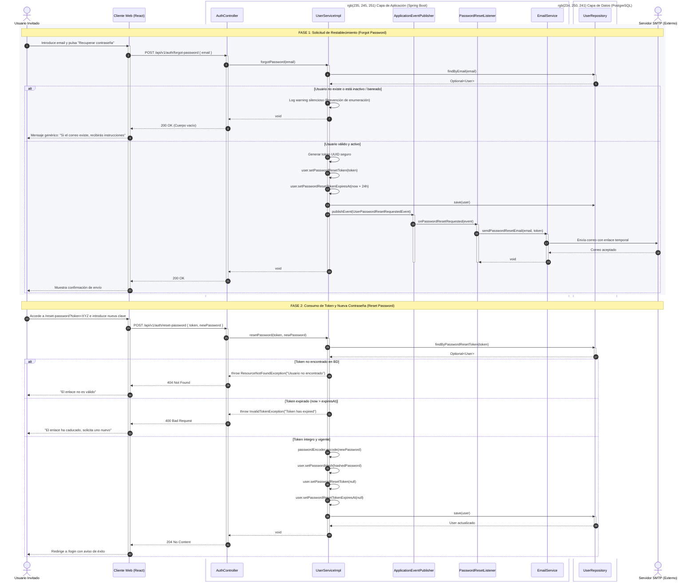
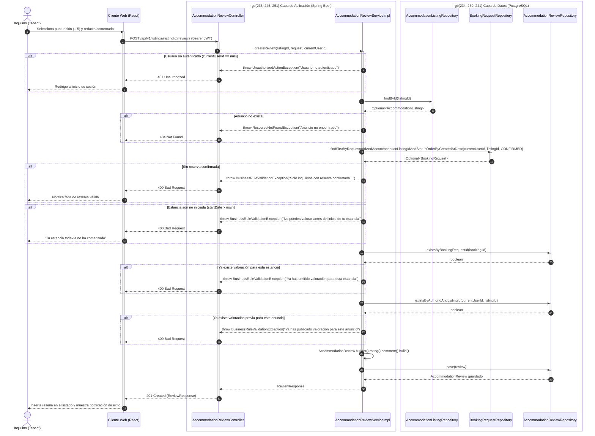
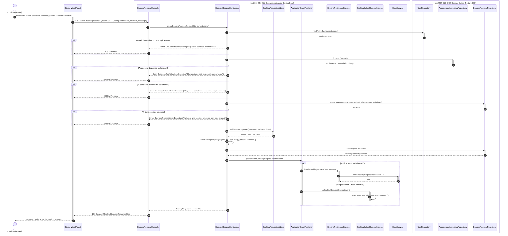
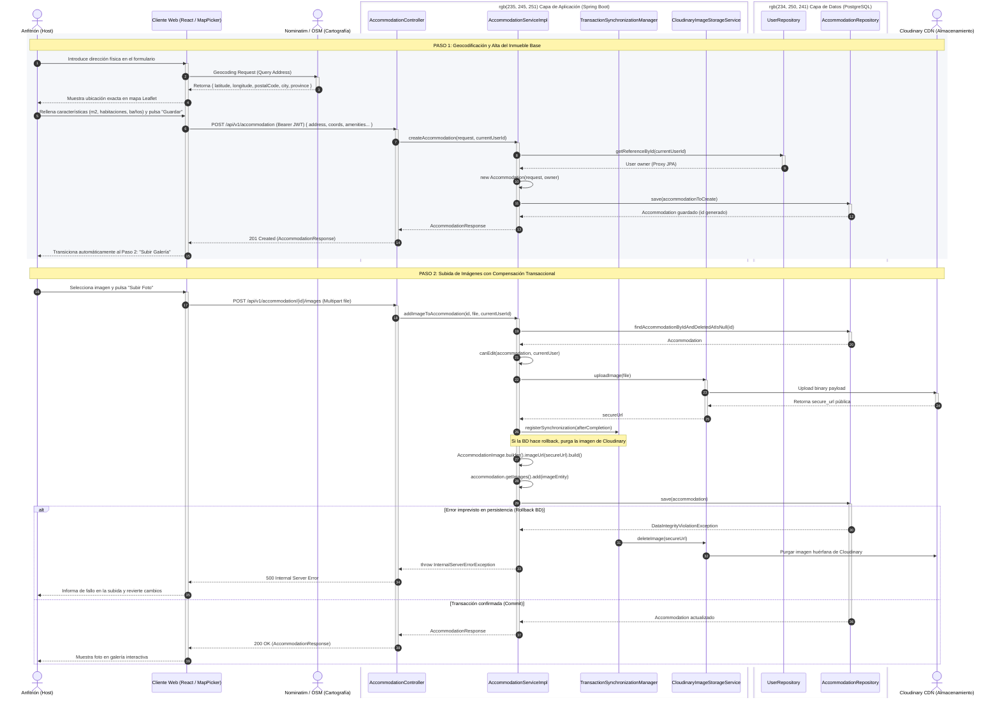

# Diagramas de Secuencia del Sistema - Plataforma Colivi

Documento de especificación de interacciones dinámicas del sistema conforme al estándar UML 2.5, implementado en sintaxis **Mermaid** para renderizado nativo directo en GitHub, GitLab, VS Code y visores Markdown.

Cada diagrama modela de forma exhaustiva las llamadas síncronas y asíncronas entre la capa de presentación (`Colivi-frontend`), los controladores REST, los servicios de aplicación, la capa de persistencia (`JPA/Hibernate`), los eventos de dominio (`Spring Application Events`) y los sistemas externos (`Cloudinary`, `SMTP`, `Nominatim`).

---

## 1. Recuperación de Contraseña (Password Reset Flow)

Flujo desacoplado en dos fases independientes para garantizar la seguridad del sistema y prevenir ataques de enumeración de usuarios (*Anti User-Enumeration Attack*).

---

## 2. Valorar un Anuncio (Review Submission Flow)

Modela la regla de negocio que exige reserva en estado `CONFIRMED` y estancia iniciada antes de admitir una valoración.

---

## 3. Solicitud de Reserva (Booking Request Submission Flow)

Modela la solicitud transaccional, las validaciones de calendario y la emisión desacoplada de eventos de dominio (`ApplicationEventPublisher`) hacia el correo y el chat.

---

## 4. Creación de Alojamiento (Accommodation Creation & Media Storage Flow)

Modela el proceso en dos pasos: geocodificación interactiva con Nominatim/OSM, persistencia del inmueble base y almacenamiento en Cloudinary con compensación transaccional ante fallos de base de datos (*Storage Leak Prevention*).

